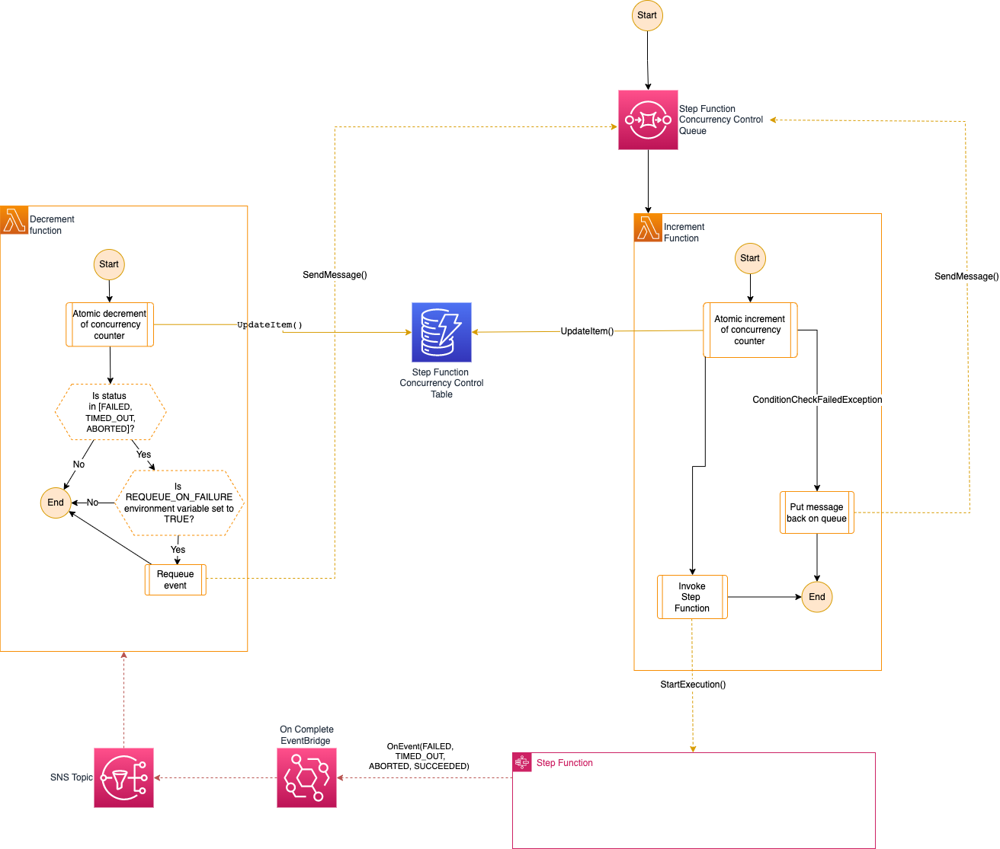

# aws-cdk-state-machine-with-concurrency-controls

This custom CDK component wraps a step function invocation with a set of resources used to control the maximum concurrency of the state machine 

## Useful commands

* `npm run build`   compile typescript to js
* `npm run watch`   watch for changes and compile
* `npm run test`    perform the jest unit tests
